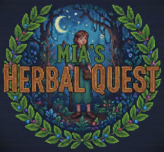

# Mia's Herbal Quest



A retro adventure game developed in **8086 Assembly**, designed specifically for the **IBM PC-XT** architecture running MS-DOS.

## The Story

Mia is a young herbalist apprentice. Her grandmother has fallen ill, and the only cure is a remedy made from three rare plants hidden deep within the mystical forest. Players must guide Mia through the woods, navigating obstacles and searching for the ingredients to save her grandmother.

## Technical Specifications

- **Target Hardware:** IBM PC-XT / Pocket 8086.
- **Processor:** Optimized for **AMD 8088-1 (10 MHz)** and **NEC V30**.
- **Graphics:** VGA Mode 13h (320x200, 256 colors).
- **Language:** 8086 Assembly (MASM 6.11 syntax).
- **Development Environment:**
  - **OS:** Linux (Cross-development).
  - **IDE:** Zed.
  - **Tools:** [Custom Go script for PNG-to-ASM conversion](https://github.com/laghoule/png2asm).
  - **Emulator:** DOSBox-X for rapid testing.

## Current Features

- **Unified Rendering Engine:** A single, optimized procedure to draw characters with transparency support.
- **4-Directional Movement:** Full control of Mia (Up, Down, Left, Right).
- **Walk Animation:** 3-frame animation cycle per direction for fluid movement.
- **VSync Synchronization:** Implemented "Wait for Vertical Retrace" to ensure flicker-free rendering at a stable 60/70 FPS.
- **High-Performance Math:** Address calculations optimized using bit-shifting (`SHL`) instead of the costly `MUL` instruction, specifically tuned for the 8088's 8-bit bus.
- **Non-Blocking Input:** Real-time keyboard sensing using BIOS interrupts (AH=01h).
- **Background Restoration System:** Full "Save/Restore" buffer logic allowing Mia to walk over complex terrains without erasing them.
- **Tiled Map Engine:** Dual-layer map system with opaque base tiles and transparent overlay items (rocks, flowers, objects).
- **PC Speaker Music:** Background music playback using the Intel 8253 PIT (Programmable Interval Timer) - features "Greensleeves" theme with configurable tempo and mute/unmute functionality.
- **Smooth Animation System:** Delta-tick based timing system ensuring consistent animation speed across different hardware configurations.

## Roadmap

- [x] **Background Restoration System:** Implement "Save/Restore" buffer logic to allow Mia to walk over complex terrains without erasing them.
- [x] **Tiled Map Engine:** Create a dual-layer tile rendering system with transparency support.
- [x] **PC Speaker Music:** Integrate background music using the Intel 8253 PIT.
- [ ] **Multi-Screen Navigation:** Implement "Flip-Screen" world navigation system (Zelda-style).
- [ ] **Collision Detection:** Implement tile-based collision sensing.
- [ ] **OPL3 Sound:** Add sound effects using the Yamaha YMF262 chip (music already implemented via PC Speaker).
- [ ] **Joystick Support:** Add support for analog game controllers via Port 201h.

## Testing

For development loop, testing is done on Dosbox-x on Linux.

And on real hardware, with Dos 6.22:

- AMD 80486 DX2/80
- Intel 8088-1
- Intel 8086-2
- Nec V30

## Assets

- **Character Sprites:** Custom 16x17 pixel art by **_Fleurman_** via [OpenGameArt.org](https://opengameart.org/content/tiny-characters-set).
- **Environment Tiles:** Based on the "Batch 5" (16x16) tileset by **Hyptosis** via [OpenGameArt.org](https://opengameart.org/content/lots-of-free-2d-tiles-and-sprites-by-hyptosis).

## Build Instructions

### Linux / Windows (UASM)

1. **Install UASM**
   - Download the compiler at https://github.com/Terraspace/UASM

2. **Assemble the code:**
   ```bash
   uasm -mz src/main.asm
   ```
3. **Run the executable:**
   - Rename `main.EXE` to `mquest.exe`.
   - Run in DOSBox-X: `dosbox-x mquest.exe`

### DOS (MASM)

1. **Assemble using MASM 6.11:** `ml /Zi /Femquest main.asm`
2. **Run in DOSBox or transfer to hardware via Diskette :)**

## Run in Browser (Docker)

This project can be run in a modern web browser using Docker and the [js-dos](https://js-dos.com/) emulator.

1.  **Build the Docker image:**

    ```bash
    docker build -t mquest .
    ```

2.  **Run the Docker container:**

    ```bash
    docker run -d -p 8080:8080 --rm --name mquest-web mquest
    ```

3.  **Open your browser:**

    Navigate to [http://localhost:8080](http://localhost:8080) to play the game.

---

_This project is a personal journey into low-level programming, bringing modern development workflows to the classic 8086/8088 architecture. It's a tribute to the era of early PCs._
